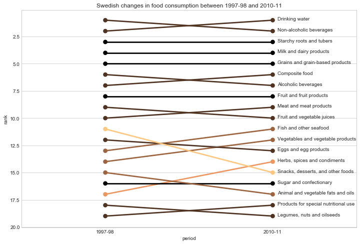
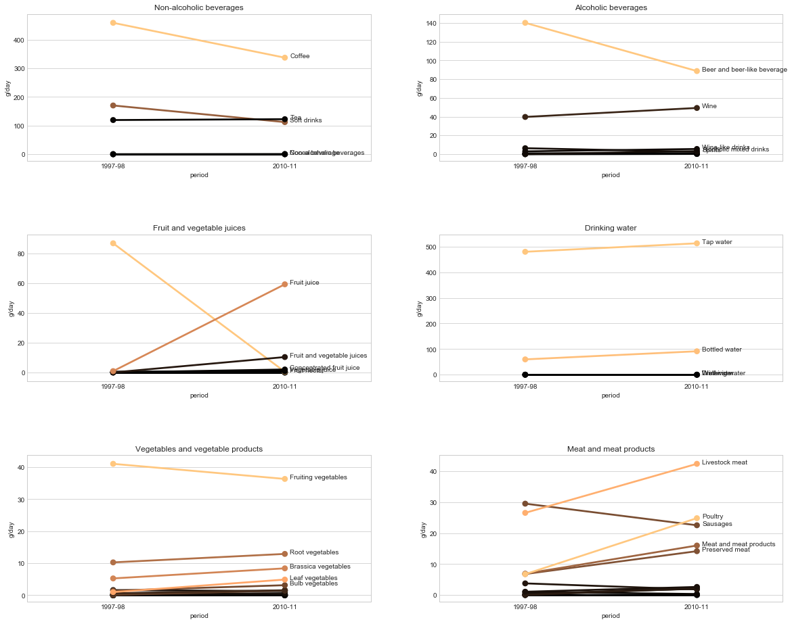
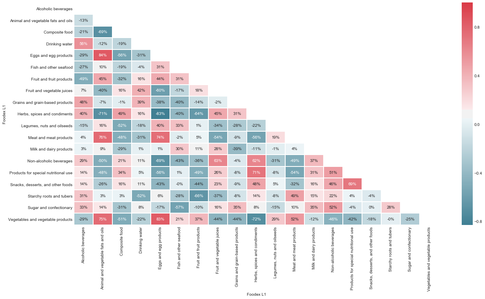
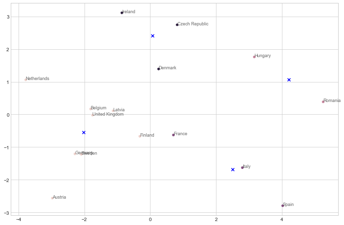
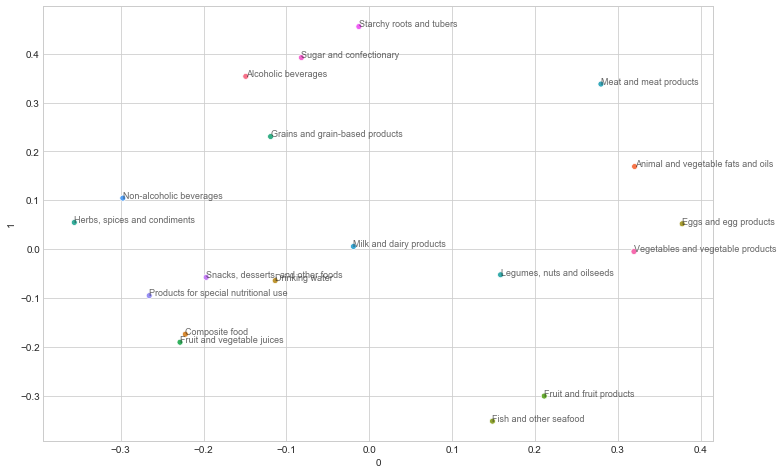

## If your country was a food, what would it be?

Every year, a flood of new food and nutrition trends are fed to us in media. "5 meals a day" is contrasted with intermittent fasting and "5:2" recommendations. And just as vegetarian diets are becoming fashionable, counter trends such as Jordan Peterson's "meat only" are becoming popular. But how has our food consumption actually changed over the last decades? And how much does it differ between different countries? 

To answer these questions, we will use a dataset on european food consumption found on the [efsa website](https://data.europa.eu/euodp/data/dataset/the-efsa-comprehensive-european-food-consumption-database/resource/0f73e423-b95a-408b-8e5b-a15de4fc97cf). This is a thourough dataset with consumption statistics for many different age groups and at a low level of granularity. However, to make results interpretable and comparable across countries, we will limit our analysis to adults only and high-level food categories.

## 1. How has food consumption changed during the last decades?

Looking at the data, we can see that some countries have performed the same study at different time intervals. This is an excellent opportunity to investigate if food patterns have evolved over time. One of these countries is Sweden and with the author coming from this country, this seems like an excellent starting point. Let's create a pointplot with the following features:

* The period of the study on the x-axis
* The relative rank in total food consumption on the y-axis
* The difference in absolute rank as the color

From this simple graph we can draw a number of conclusions:

* Beverages make up the largest quantities in both studies
* Trends in healthy eating seem to be reflected in the high-level changes in consumption: Less snacks, fats and alcohol; more fish, vegetables and non-sweetened beverages
* Despite vegetarian and vegan food becoming more popular, meat consumption has actually increased

Let's take a closer look at beverages, as well as meat vs vegetables:

This deep-dive adds nuance to the overall patterns:

* From being pre-dominantly a beer country, alcohol intake is now mixed between wine and beer. Assuming a 14% vs 5% alcohol content, wine actually makes up a larger share of total alcohol intake
* There has been a shift from sugary beverages (soft drinks, juices) to regular drinking water
* Despite all (non-fruit) vegetable categories increasing, meat consumption has gone up in all major categories except sausages

\* The fine details of the study notes that respondents had a hard time differenting between juices and nectars. Therefore, these categories are treated as the same. In aggregate, this category has decreased by more than 25% 

Let's dive into the beatiful world of data and statistics to get the answer:

## 2. What food categories are popular together?

Next, let's investigate the relationship between different food products. This can be done with a correlation matrix:

From this chart, a number of interesting relationships can be found:

* High levels of animal and vegetable fats is very correlated to high intakes of animal products such as meat and eggs, but also to vegetables. 
* Composite food is negatively related to all fresh food such as vegetables, meat and fruit. And positively related to additives and sugary beverages
* Surprisingly, drinking water is positively correlated to all other beverage categories

It is important to remember that these relationships are for averages at country level and not for individuals. Still, it gives some insight into the consumption patterns at an aggregated level

## 3. What countries have similar food consumption and what food items are representative of these clusters?

Lastly, let's see if we can find out what countries have similar consumption patterns, as well as what food items are typical for each cluster. To do this, we apply a technique called Principal Component Analysis (PCA) which lets us reduce the amount of variables. While this will make us lose some of the information in the data, it reduces complexity and makes it much easier to interpret the results.

First, we'll plot each country on the principal components axises. We will also plot the center of each cluster:

Interesting - we seem to have a latin, an eastern european and a germanic cluster. We also has a cluster that is less intuitive, consisting of Ireland, Czech Republic and Denmark. Let's compare these clusters to how the food items contribute to each axis:

Not surprisingly, the latin countries have a high consumption of fruit and seafood while the eastern european cluster has a high degree of fats and animal products. We also get an explanation to the not immediately obvious cluster of Ireland, Czech and Denmark - they all have high volumes of carbohydrates such as grains, sugar, beer and potatoes.

## Summary

As can be seen, we could learn a lot about changes and similarities in consumption just by looking at the top categories. To learn even more, one could look at food items at a more detailed level. Or perhaps some select foods of special interest - whatever ticks your interest. Download the [data](https://data.europa.eu/euodp/data/dataset/the-efsa-comprehensive-european-food-consumption-database/resource/0f73e423-b95a-408b-8e5b-a15de4fc97cf) and have a go yourself!

Lastly - what cluster does your home country belong to? And what food items are defining that cluster? Let me know in the comments section below!
